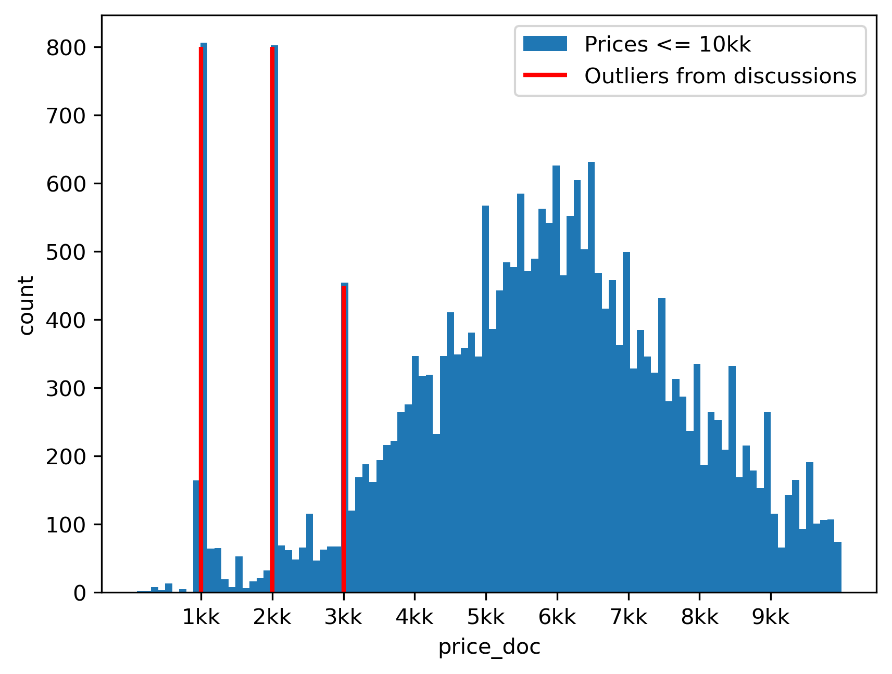

Preprocessing and Canonical Splits
=================================

**General preprocessing steps**

- Load the data (All Datasets are hosted on Kaggle, for some you need to accept the competition
  rules to be able to load them).
- Make sure there are consistent time features (e.g. `hour_of_day, day_of_week, day_of_month, month, year[optional]` where appropriate)
- `[optional]` Feature engineering with joins and aggregations if multiple tables were present at the start
- `[optional]` Merge infrequent categories into one (< 1% of instances). Reasoning: such features are prone to overfitting, we've encountered some mehtods (GBDTs, ResNet in particular) failing when using infrequent unique id-like cat. features in the cooking-time datasest.
- `[optional]` Uniformly downsample large datasets to the 100k+ sizes. This is done to make benchmarking less compute intensive (preliminary experiments on larger datasets did not demonstrate differences except compute)
- Create the canonical train/val/test splits (see next sections).

> [!NOTE]
> Some preprocessing scripts may require up to 30-40 GB of RAM and disk space (e.g. the Ecom Offers datasets with 360 million aggregations)

To create a specific dataset run the following from the repo root:

```sh
mkdir -p data
python preprocessing/<script>.py
```

**Default Time-Based Split**

The default splits is the one used for benchmarking. For each task we split samples based on time.

```
     train time range    val time range  test time range
|-----------------------|---------------|---------------|
```


**Splits for the Analysis**

We include N samples in the validation and test sets and make three datasets with a sliding window for averaging over
different dataset splits. For each window we also create a randomly split dataset.

```
 N val/test samples
|---------------|-----------------------------------------------------------------------|  <-- Whole set of instances


         train-0              val-0         test-0
|-----------------------|---------------|---------------|                                  <-- Time Split 0 (random-0 is a shuffle of these instances)
                         train-1              val-1           test-1
|---------------|-----------------------|---------------|---------------|                  <-- Time Split 1 (...)
                                        train-2              val-2           test-2
|---------------|---------------|-----------------------|---------------|---------------|  <-- Time Split 2 (...)


```


Specific Dataset Notes
---------------------

We collect relevant discussion about dataset specifics that affect preprocessing in this section.

## Homesite Insurance Quotes

We used information provided in the competition forum by the competition organizers to preprocess features.

**Feature Types**

https://www.kaggle.com/competitions/homesite-quote-conversion/discussion/17382#99973

> gpok, All of the fields ending in 'A' or 'B' are ordinal. In other words, PersonalField4A and
> PersonalField4B are different approaches for creating an ordinal variable out of PersonalField4.
> All other fields are either categorical or numeric and should be self-explanatory based on the
> corresponding values. Hope this helps. Thanks.

**Missing value encoding** 

https://www.kaggle.com/competitions/homesite-quote-conversion/discussion/17417

Q:
> Hi, should we interpret -1 as a missing value? Because that has quite a different meaning than
> letting it have a certain categorical value.

A:

> Gerben, We did code our missing values as -1.

> Siva, For the ordinal variables that were bucketed we coded missing values as -1. There may also
> be some values for the numeric fields that are actually missing as you point out. There are a few
> reasons why the information might be missing. One possibility, like you suggest, is that the field
> is optional during the quote and the customer chooses not to provide it. Another reason this can
> happen is that the required fields for quoting change over time. The data spans several years and
> if we just started asking a particular question recently, the values will be missing for older
> quotes. A third reason that is very common with our data comes from the fact that we have
> different quoting platforms on multiple channels (i.e. Agents, Call Centers, Internet) across
> multiple partners. The questions asked in each of these platforms is often different and so if a
> question is not asked for Partner X, then the values for that field will be missing for all quotes
> with Partner X in the data.


-1 in ordinal variables means missing values.
We treat ordinal as numeric features by default


**Splits**

Default split:
- 2 years in the training set (2013-01-01 to 2015-01-31)
- 2 month in the validation set (2015-02-01 to 2015-03-31)
- 2 month in the test set (2015-04-01 to 2015-05-18)

Analysis splits:
- 20k instances in test and validation sets (roughly 2-3 month time-frame). 
- Window shifts by 20k instances


## Sberbank Housing Market Forecasting

**Fix errors in distance parameters**

https://www.kaggle.com/c/sberbank-russian-housing-market/discussion/34364

> For those who is not aware of the issue, there was a problem with coordinates for some properties which lead toerrors in distances parameters, because they were calculated from the heart of Moscow for such cases, which is wrong. The absence of the coordinates was due to wrong addresses or, which is the most common reason, due to the fact that for newly-built apartments the addresses were 'developer's' addreses, not yet official postal addresses.
> We tried to locate those development projects manually and found the closest ID from our train or test database and filled the GIS-related parameters with such of the closest ones. So this is a rough approximation of those features.
> Some properties unfortunately are still not known, they will be excluded from evaluation on test set.
> The file with the parameters is in the attachment, please feel free to use it and ask questions on it. Thanks and sorry for this issue!

We use the provided fixed data for the 550 instances and remove 53 instances that have wrong `kremlin_km` values and were not correctted in the provided `BAD_ADDRESS_FIX.xlsx`

**Remove outliers and log-transform target**

https://www.kaggle.com/competitions/sberbank-russian-housing-market/discussion/35684

> I didn't predict full apartment prices directly, but prices per 1 square meter.

We also convert target to the price per square meter. We use `log(price_doc / full_sq)` as the final target.

> There are many low bad prices at the data. As they related to avoid tax purposes of sellers and we hadn't information about sellers enough to detect them, I decided to drop them. Fake prices were not only prices with 1-2-3 millions. In some areas 2 or 3 million were real prices, in other even 10 million were much lower than market. I used my investment model to find them (I guess that most of non-investment prices were real) and drop data were prediction and target were much different (2 times or more). And repeated process one more after first iteration to clean more. Totally I dropped near 10% of train set as data with bad prices.


We follow [@johnpateha](https://www.kaggle.com/johnpateha)'s approach (from the above 1st place solution report) and filter `price_doc` outliers (with a simpler rule: `price_doc <= 3_000_000` -- this filters out most outliers, more concretely we remove instances with `price_doc == 2kk` `price_doc == 3kk` and `price_doc <= 1kk`).

Zoomed-in prices chart with apparent outliers discussed above:



See also, another [discussion](https://www.kaggle.com/competitions/sberbank-russian-housing-market/discussion/32717) of outliers in the `price_doc` target we've used.

https://www.kaggle.com/code/nickycan/feature-engineering-public-6th-private-9th

> fill missing values in full_sq, life_sq, kitch_sq, num_room use apartment strategy to fill the most likely values

Relevant code from the notebook:
```python
df_new.loc[df_new.full_sq == 5326.0, 'full_sq'] = 53
df_new.loc[df_new.full_sq < 10, 'full_sq'] = np.nan
df_new.loc[df_new.life_sq == 2, 'life_sq'] = np.nan
df_new.loc[df_new.life_sq == 7478.0, 'life_sq'] = 48
```

There are a few errors (less than 100 samples) that nevertheless may significantly influence results when using full_sq variable (especially as a part of the target).
We remove instances with `full_sq <= 5` (26 instances) and one instance with `full_sq == 5326`.

**Splits**

Default Split:

- 3 years in the training set (2011-08-20 to 2014-06-29)
- 5 month in the validation set (2014-06-30 to 2014-11-29)
- 7 month in the test set (2014-12-01 to 2015-06-30)

Analysis splits:
- 4.5k instances in test and validation sets (roughly 5-7 month time-frame).
- Window shifts by 4.5k instances

## Homecredit Default Stability (homecredit 2.0)

We adapt the preprocessing code from the following solution:
- https://www.kaggle.com/competitions/home-credit-credit-risk-model-stability/discussion/507946
- https://www.kaggle.com/code/yuuniekiri/fork-of-home-credit-catboost-inference

**Splits**

Default Split:
- 1 year in the training set (2019-01-01 to 2019-12-31)
- 4 month in the validation set (2020-01-01 to 2020-04-30)
- 4.5 month in the test set (2020-05-01 to 2020-10-05)

Analysis Splits:
- 50k instances in the test and validation sets (roughly 2-4 month)
- Window shifts by 50k instances

## Ecom Offers (Acquire Valued Shoppers by DMDave)

We base preprocessing on one of the top solutions from the competiton
([code](https://github.com/MLWave/kaggle_acquire-valued-shoppers-challenge)). We rewrite the
preprocessing code to make preprocessing faster, but make sure it outputs same features.

**Splits**

Default Split:
- 1.5 month in train (2013-03-01 to 2013-04-19)
- 4 days in val (2013-04-20 to 2013-04-24)
- 5 days in test (2013-04-25 to 2013-04-30)

Analysis Splits:
- 20k instances in test and validation sets (5-15 days)
- Window shifted by 20k instances


## Cooking Time

**Filtering and subsampling**

- Dataset is a 2.5% random sample of the original month log of data.
- ~200 samples with cooking time of less than 1 minute are filtered
- All targets are log transformed. See the target distribution for the reasoning behind this.
  Training with the MSE error on a log transformed version of the dataset is ~equivalent to
  optimizing MAE error of the original data (which is close to the task metric of interest).

**Feature Types**

All features are already processed and categorized into numeric, categorical and binary. (`[num|bin|cat]_{i}`).

**Splits**

Default split:
- 36 days in the train set (15.11.2023 -- 20.12.2023)
- 1 week in the validation set (21.12.2023 -- 27.12.2023)
- 1 week in the test set set (28.12.2023 -- 03.01.2024)

Analysis splits:
- 40k samples in the validation set and in the test set (approximately a week of orders). This
  leaves ~24-25 days in the train set.
- Window shifts by 40k instances.

## Delivery ETA

**Filtering and subsampling**
- Dataset is a 2.5% random sample of the original month log of data.
- Instances for which delivery time is less than a minute are filtered
- Targets are log-transformed. Similar to the Cooking Time targets.


**Feature Types**

All features are already processed and categorized into numeric, categorical and binary. (`[num|bin|cat]_{i}`). We only add 3 features based on timestamp

**Splits**

Default split:
- 56 days in the train set (20.10.2023 -- 11.12.2023)
- 1 week in the validation set (11.12.2023 -- 18.12.2023)
- 1 week in the test set set (18.12.2023 -- 25.01.2024)

Analysis splits:
- 40k samples in the validation set and in the test set (approximately a week of orders). This
  leaves ~40-60 days in the train set.
- Window shifts by 40k instances.

## Weather

**Filtering and subsampling**

- The full weather dataset contains instances for temperature prediction in the "A (Tropical)" climate zone by the [Köppen climate classification](https://en.wikipedia.org/wiki/K%C3%B6ppen_climate_classification). We chose to focus on one climate zone to focus on temporal shift aspects only.
- Dataset used in the benchmark is a 2.5% random sample of the original year+ of data

**Feature Types**

All expect three `CMC_available, GFS_available, gfs_soil_temperature_available` features are numerical. Feature descriptions are in the datasheet. 

**Splits**

Default split: 
- 11 month in the training set (01.07.2022 -- 31.05.2023)
- 1 month in the validation set (01.06.2023 -- 30.06.2023)
- 1 month in the test set (01.07.2023 -- 30.07.2023)

Analysis splits:
- 40k samples in the validation and test sets -- roughly one month of data
- window shifts by 40k instances


## Maps Router ETA

**Filtering and subsampling**

- Dataset is a 2.5% random sample of the original month log of data.

**Feature Types**

All features are already processed and categorized into numeric, categorical and binary. (`[num|cat]_{i}`).

**Splits**

Default split: 
- 3 weeks in the training set (01.11.2023 -- 20.11.2023)
- 1 week in the validation set (20.11.2023 -- 27.11.2023)
- 1 week in the test set (27.11.2023 -- 04.12.2023)

Analysis splits:
- 60k samples in the validation and test sets -- roughly one month of data
- window shifts by 60k instances

