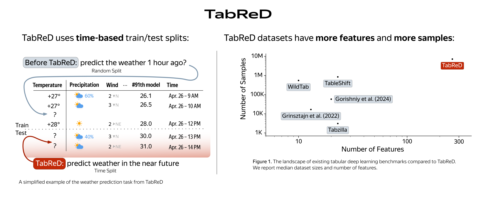

<p align="center">
  
</p>

<p align="center">
  <b>TabReD: Analyzing Pitfalls and Filling the Gaps in Tabular Deep Learning Benchmarks</b>
</p>

TabReD is a collection of eight industry-grade tabular datasets designed to evaluate machine learning methods under more realistic conditions: temporal distribution shift, rich feature sets from feature engineering pipelines, closer aligned with some real world applications of tabular machine learning.

 :scroll: [arXiv](https://arxiv.org/abs/2406.19380) :books: [Other tabular DL projects](https://github.com/yandex-research/rtdl)

## Download TabReD

To download TabReD datasets, follow the steps below.

**Step 1.** Install [uv](https://docs.astral.sh/uv).

**Step 2.** Create or log in to your existing Kaggle account and complete the authentication process as described [here](https://github.com/Kaggle/kaggle-cli/blob/main/docs/README.md).

**Step 3.** 

To download all TabReD datasets to the default location, run:

```
uvx tabred download
```

To download all TabReD datasets to a custom location, run:

```
uvx tabred download --output-path path/to/directory
```

To download only some of the TabReD datasets (for example, the Cooking Time and Weather datasets), run:

```
uvx tabred download cooking-time weather
```

## Datasets

| Dataset            | Features | Task           | Instances Used | Instances Available | Source                                                                                     |
| ------------------ | -------- | -------------- | -------------- | ------------------- | ------------------------------------------------------------------------------------------ |
| Homesite Insurance | 299      | Classification | 260,753        | -                   | [Competition](https://www.kaggle.com/competitions/homesite-quote-conversion)               |
| Ecom Offers        | 119      | Classification | 160,057        | -                   | [Competition](https://www.kaggle.com/c/acquire-valued-shoppers-challenge)                  |
| Homecredit Default | 696      | Classification | 381,664        | 1,526,659           | [Competition](https://www.kaggle.com/competitions/home-credit-credit-risk-model-stability) |
| Sberbank Housing   | 392      | Regression     | 28,321         | -                   | [Competition](https://www.kaggle.com/competitions/sberbank-russian-housing-market)         |
| Cooking Time       | 192      | Regression     | 319,986        | 12,799,642          | [Dataset](https://www.kaggle.com/datasets/irubachev/tabred)                                |
| Delivery ETA       | 223      | Regression     | 416,451        | 17,044,043          | [Dataset](https://www.kaggle.com/datasets/irubachev/tabred)                                |
| Maps Routing       | 986      | Regression     | 340,981        | 13,639,272          | [Dataset](https://www.kaggle.com/datasets/irubachev/tabred)                                |
| Weather            | 103      | Regression     | 423,795        | 16,951,828          | [Dataset](https://www.kaggle.com/datasets/irubachev/tabred)                                |

## Preprocessed data format

The downloader unpacks each dataset into its own directory:

```
data/<dataset>/
├── info.json
├── x_num.npy
├── x_cat.npy          # when present
├── x_bin.npy          # when present
├── x_meta.npy
├── y.npy
└── splits/
    ├── default/
    │   ├── train.npy
    │   ├── val.npy
    │   └── test.npy
    ├── random-{0,1,2}/
    │   ├── train.npy
    │   ├── val.npy
    │   └── test.npy
    └── sliding-window-{0,1,2}/
        ├── train.npy
        ├── val.npy
        └── test.npy
```

The `x_*.npy` files contain feature matrices, `y.npy` contains targets, and
`info.json` contains task metadata. Split files contain row indices into these
arrays. The `default` split is the main split from the TabReD paper; the random
and sliding-window splits are provided for split-strategy studies.

## Repository structure

- `src/tabred`: downloader package and CLI.
- `paper`: code for reproducing the paper

## Rebuilding datasets from raw sources

Most users should use the preprocessed downloader above. The preprocessing pipeline is kept in this repository for reproducibility and maintenance, but it is not the recommended way to obtain the benchmark data.

> The cleaned-up dataset preparation scripts will be published in a few days (@puhsu 10.07.26). For now consult the previous commits and the preprocessing folder there.

## Citation

If you use TabReD, please cite:

```bibtex
@inproceedings{
 rubachev2025tabred,
 title={TabReD: Analyzing Pitfalls and Filling the Gaps in Tabular Deep Learning Benchmarks},
 author={Ivan Rubachev and Nikolay Kartashev and Yury Gorishniy and Artem Babenko},
 booktitle={The Thirteenth International Conference on Learning Representations},
 year={2025},
 url={https://openreview.net/forum?id=L14sqcrUC3}
}
```
